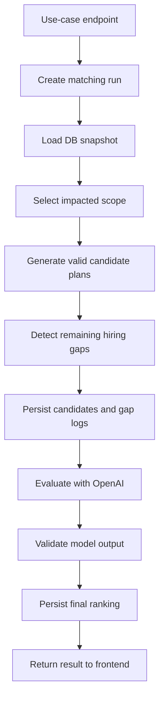

# Backend Matching Feature Plan

## Purpose

The backend matching feature recommends explainable employee-to-project assignment
changes for the CTO workflow. It should support three operational moments:

1. Balancing the current portfolio when no single new object triggered the run.
2. Rebalancing after a project is created or its staffing needs change.
3. Detecting when the current employee pool cannot safely maintain all projects
   and recommending which roles the company should hire.

The feature is a two-step pipeline:

1. Deterministic strict-rule generation creates a bounded set of valid assignment
   or reassignment possibilities.
2. OpenAI evaluation ranks those possibilities for softer tradeoffs such as team
   fit, ramp-up effort, preferences, and business risk.

The OpenAI step must never invent employees, projects, skills, or assignments. It
only evaluates candidates produced by the deterministic step.

## Current State

The repository already has the right high-level boundaries:

- `backend/main.py` is the FastAPI orchestration API. It already exposes
  `POST /projects/{project_id}/matching:run` and
  `POST /matching/portfolio:rebalance` for synchronous Step 1 runs.
- `backend/services/matching_service.py` delegates matching runs to the shared
  pipeline in `backend/services/matching/pipeline.py`.
- `backend/clients/db_client.py` is the backend's DB API client. Matching should
  use this client instead of opening database connections directly.
- `backend/clients/llm_client.py` provides the OpenAI client.
- `db-rest-api/` owns shared database persistence.
- `docs/DB_API_DOCUMENTATION.md` is the canonical database API contract.

The database now stores projects, employees, assignments, move requests, and
matching persistence records in `db-rest-api`: runs, strict-rule candidates,
ranked recommendations, hiring recommendations, and frontend-visible run events.

Implemented two-step behavior:

- Strict rules load projects, employees, and move requests from `DbApiClient`.
- The effective rule config and input snapshot are saved on `matching_runs`.
- Deterministic candidate plans are saved to `matching_candidates` with
  `strict_score`, `hard_rule_summary`, and rich `plan_payload` data.
- Hiring gaps are saved to `matching_hiring_recommendations`.
- Frontend-visible strict-rule progress is saved to `matching_run_events`.
- When strict rules produce at least one candidate, OpenAI evaluates the bounded
  candidate set, picks the best plan, optionally returns alternatives, and the
  backend saves those rows to `matching_recommendations`. The LLM request is
  capped to the top 8 strict-rule candidates to stay within demo TPM limits.
- Runs with candidates complete with `recommendation_count > 0` and
  `selected_candidate_plan_id` set to the LLM-selected plan. Runs with no strict
  candidates complete without LLM ranking and return hiring gaps when available.

## Design Principles

- Keep strict rules deterministic, testable, and fast.
- Keep LLM evaluation advisory and constrained to validated candidate plans.
- Use IDs for all logic. Names are display aliases only.
- Persist every matching run so the frontend can show current and historical
  recommendations.
- Persist user-facing logs as structured run events, not freeform application
  logs.
- Treat assignment changes as explicit operations. A matching run recommends a
  plan; it does not silently mutate `project_assignments`.
- Create move requests from accepted recommendations, then apply assignment
  changes through explicit project or employee update endpoints.
- Return hiring recommendations when strict rules show that reassignment would
  leave one or more projects below acceptable coverage.
- Make configuration data-driven enough to tune rules without changing the
  pipeline shape.

## Use Cases

### Portfolio rebalance

Goal: improve the existing assignment map across active projects.

Trigger examples:

- CTO opens a portfolio staffing view and clicks "Rebalance".
- A scheduled/manual run detects multiple projects below staffing target.
- Leadership wants a low-disruption recommendation for the current state.

Scope should include only projects with a visible staffing problem and employees
connected to those projects or plausible nearby moves. It should not explore the
entire combinatorial assignment space by default.

Endpoint:

```http
POST /matching/portfolio:rebalance
```

### Project matching or rebalance

Goal: staff a new project or rebalance around one updated project.

Trigger examples:

- CTO creates a new project.
- CTO changes `required_people_amount` or `required_skills`.
- A project is under-staffed after employees moved away.

Endpoint:

```http
POST /projects/{project_id}/matching:run
```

This endpoint can keep the existing route and expand the request model with a
use-case field if needed, but a project-scoped endpoint should remain because it
maps directly to the product flow.

### Hiring gap recommendation

Goal: identify when the company cannot maintain the current project portfolio
with existing employees and return the exact role profiles it needs to hire.

Trigger examples:

- Portfolio rebalance cannot produce a valid low-risk plan.
- A new project can only be staffed by creating unacceptable gaps elsewhere.
- Multiple projects need the same scarce capability, such as senior backend or
  infrastructure coverage.

This is not a separate employee-placement flow. The company is assumed to hire
for an existing role in an existing project. Hiring recommendations are an
outcome of portfolio or project matching runs.

## API Shape

Use separate public endpoints for the supported matching triggers, then route
each one to the same shared pipeline.

Example request:

```json
{
  "requested_by": "cto@example.com",
  "policy_name": "balanced"
}
```

The body is optional. Run endpoints accept `policy_id` or `policy_name` for
stored policy selection, defaulting to `Balanced strict matching`; raw matching
configuration is not accepted on run endpoints.

Example response:

```json
{
  "run_id": 42,
  "use_case": "project_rebalance",
  "status": "completed",
  "target_project_id": 7,
  "candidate_count": 1,
  "recommendation_count": 1,
  "hiring_recommendation_count": 1,
  "selected_candidate_plan_id": "plan_01",
  "summary": "Generated 1 strict-rule candidate plans; OpenAI selected plan_01 and returned 1 ranked recommendations with 1 hiring recommendations.",
  "candidates": [
    {
      "candidate_plan_id": "plan_01",
      "strict_score": 0.82,
      "summary": "Move 3 toward Project 7 to reduce headcount or skill gaps.",
      "moves": [
        {
          "employee_id": 3,
          "from_project_id": 2,
          "to_project_id": 7,
          "action": "move",
          "suggested_role": "Backend/platform engineer",
          "current_project_impact": "low",
          "hard_rule_reasons": [
            "Employee and target project exist in the DB snapshot.",
            "Move improves or preserves target coverage.",
            "Source project remains above strict minimums."
          ],
          "reason": "Backend 3 and infrastructure 2 match the target gap."
        }
      ],
      "risks": [
        "Project 2 loses one backend-capable engineer but remains above strict minimums."
      ],
      "hard_rule_summary": {
        "valid": true,
        "target_project_id": 7,
        "move_count": 1
      },
      "plan_payload": {
        "summary": "Move 3 toward Project 7 to reduce headcount or skill gaps.",
        "moves": [
          {
            "employee_id": 3,
            "from_project_id": 2,
            "to_project_id": 7,
            "action": "move",
            "suggested_role": "Backend/platform engineer",
            "current_project_impact": "low",
            "hard_rule_reasons": [
              "Employee and target project exist in the DB snapshot.",
              "Move improves or preserves target coverage.",
              "Source project remains above strict minimums."
            ],
            "reason": "Backend 3 and infrastructure 2 match the target gap."
          }
        ],
        "risks": [
          "Project 2 loses one backend-capable engineer but remains above strict minimums."
        ],
        "project_coverage_after": {
          "7": {
            "headcount_gap": 0,
            "skill_gap": {
              "android": 0,
              "ios": 0,
              "web": 0,
              "backend": 0,
              "infrastructure": 0,
              "ai": 0
            },
            "available_skills": {
              "android": 0,
              "ios": 0,
              "web": 2,
              "backend": 3,
              "infrastructure": 2,
              "ai": 0
            },
            "coverage_ratio": 1.0
          }
        }
      }
    }
  ],
  "recommendations": [
    {
      "candidate_plan_id": "plan_01",
      "rank": 1,
      "fit_score": 0.91,
      "summary": "Best balance of target coverage and low source disruption.",
      "explanation": "The suggested move closes the backend and infrastructure gap with low source-project disruption.",
      "risks": [
        "Project 2 loses one backend-capable engineer but remains above strict minimums."
      ],
      "ramp_up_estimate": null,
      "suggested_moves": [
        {
          "employee_id": 3,
          "from_project_id": 2,
          "to_project_id": 7,
          "action": "move",
          "suggested_role": "Backend/platform engineer",
          "current_project_impact": "low",
          "hard_rule_reasons": [
            "Employee and target project exist in the DB snapshot.",
            "Move improves or preserves target coverage.",
            "Source project remains above strict minimums."
          ],
          "reason": "Backend 3 and infrastructure 2 match the target gap.",
          "move_request_reason": "Best balance of target coverage and low source disruption."
        }
      ],
      "model_metadata": {
        "model": "gpt-4o",
        "prompt_version": "matching_llm_evaluator_v1"
      }
    }
  ],
  "hiring_recommendations": [
    {
      "project_id": 7,
      "role_title": "Senior backend/platform engineer",
      "count": 1,
      "required_skills": {
        "android": 0,
        "ios": 0,
        "web": 1,
        "backend": 3,
        "infrastructure": 2,
        "ai": 0
      },
      "reason": "Existing reassignment options would create a backend coverage gap in source projects.",
      "urgency": "high"
    }
  ],
  "logs": [
    {
      "level": "info",
      "stage": "strict_rules",
      "event_type": "strict_rules.completed",
      "message": "Generated 18 valid candidate plans."
    }
  ]
}
```

Read endpoints:

```http
GET /matching-runs/{run_id}
GET /matching-runs/latest?use_case=project_rebalance&target_project_id=7
GET /projects/{project_id}/matching/latest
```

Action endpoints:

```http
POST /matching-runs/{run_id}/recommendations/{candidate_plan_id}/move-requests
```

The action creates `move_requests` only from persisted
`matching_recommendations`. Matching runs with strict candidates now write
LLM-ranked recommendations, so the action endpoint can create move requests from
the selected recommendation. Direct assignment mutation should be kept
admin-only or postponed until the product is ready for it.

## Shared Pipeline Location

Keep FastAPI route handlers thin and put reusable matching logic in services.

Proposed layout:

```text
backend/
  services/
    matching_service.py              # public orchestration service used by routes
    matching/
      __init__.py
      pipeline.py                    # run_matching_pipeline entry point
      models.py                      # internal typed pipeline DTOs
      strict_rules.py                # step 1 candidate generation
      llm_evaluator.py               # step 2 OpenAI ranking
      config.py                      # defaults and config validation
      logging.py                     # frontend-visible run events
```

The common entry point should receive the use case and target identifiers:

```python
run_matching_pipeline(
    use_case: MatchingUseCase,
    target_project_id: int | None,
    request: MatchRequest,
) -> MatchingResult
```

All use-case endpoints should call this function after validating their own
path parameters.

## Pipeline Overview



Step 1 and step 2 have separate detailed plans:

- `backend/docs/MATCHING_STRICT_RULES_PLAN.md`
- `backend/docs/MATCHING_LLM_EVALUATION_PLAN.md`

## Data Snapshot

Each run should use an immutable snapshot of the data it evaluated. This keeps
results explainable even if projects or employees change afterward.

Snapshot content:

- Target project, when the run is project-scoped.
- Projects in scope with required skills, required headcount, phase, repository
  links, and current team member IDs.
- Employees in scope with role, skills, preferences, interests, and current
  project IDs.
- Open move requests that could conflict with proposed moves.
- Rule configuration and version.
- LLM prompt version and model name, if step 2 runs.

Do not store secrets, API keys, raw OpenAI credentials, or hidden environment
values in snapshots or logs.

## Persistence Plan

Persistence belongs in `db-rest-api`, with documentation in
`docs/DB_API_DOCUMENTATION.md`. The backend should access these records through
`DbApiClient`.

Implemented tables:

```sql
matching_runs(
  id,
  use_case,
  target_project_id,
  status,
  requested_by,
  rule_config,
  input_snapshot,
  candidate_count,
  recommendation_count,
  hiring_recommendation_count,
  selected_candidate_plan_id,
  summary,
  error_message,
  created_at,
  started_at,
  completed_at
)
```

```sql
matching_candidates(
  id,
  run_id,
  candidate_plan_id,
  strict_score,
  hard_rule_summary,
  plan_payload,
  rejected_reason,
  created_at
)
```

```sql
matching_recommendations(
  id,
  run_id,
  candidate_plan_id,
  recommendation_rank,
  fit_score,
  summary,
  explanation,
  risks,
  ramp_up_estimate,
  suggested_moves,
  model_metadata,
  created_at
)
```

```sql
matching_hiring_recommendations(
  id,
  run_id,
  candidate_plan_id,
  project_id,
  role_title,
  count,
  required_skills,
  reason,
  urgency,
  suggested_assignment,
  created_at
)
```

```sql
matching_run_events(
  id,
  run_id,
  level,
  stage,
  event_type,
  message,
  metadata,
  created_at
)
```

Keep event rows append-only. If a run is deleted, cascade its candidates,
recommendations, hiring recommendations, and events.

Implemented DB API endpoints:

```http
GET /matching-runs
POST /matching-runs
GET /matching-runs/latest?use_case=project_rebalance&target_project_id=7
GET /matching-runs/{run_id}
PUT /matching-runs/{run_id}
DELETE /matching-runs/{run_id}
GET /projects/{project_id}/matching/latest
GET /matching-runs/{run_id}/candidates
POST /matching-runs/{run_id}/candidates
GET /matching-candidates/{candidate_id}
GET /matching-runs/{run_id}/recommendations
POST /matching-runs/{run_id}/recommendations
GET /matching-recommendations/{recommendation_id}
GET /matching-runs/{run_id}/hiring-recommendations
POST /matching-runs/{run_id}/hiring-recommendations
GET /matching-runs/{run_id}/events
POST /matching-runs/{run_id}/events
POST /matching-runs/{run_id}/recommendations/{candidate_plan_id}/move-requests
```

The move-request action creates `move_requests` from a selected
recommendation's `suggested_moves`. It does not mutate `project_assignments`.

## Frontend-Visible Logging

The product needs logs that can be displayed as a progress timeline or audit
view. These are not Python process logs. They are structured matching run
events stored in the database.

Event examples:

- `strict_rules.started`
- `strict_rules.scope_selected`
- `strict_rules.coverage_computed`
- `strict_rules.candidates_generated`
- `strict_rules.candidates_pruned`
- `strict_rules.hiring_gaps_detected`
- `strict_rules.completed`
- `strict_rules.no_candidates`
- `strict_rules.failed`
- `llm_evaluation.started`
- `llm_evaluation.completed`

Each event should include:

- `run_id`
- `level`: `debug`, `info`, `warning`, or `error`
- `stage`: `request`, `snapshot`, `strict_rules`, `hiring_gap`,
  `llm_evaluation`, `persistence`, or `action`
- `message`: short safe display text
- `metadata`: compact JSON with counts and public IDs

Do not store prompt text in regular events. Store prompt and model metadata only
in the run or recommendation record if needed for audit/debugging.

## Configuration

Start with defaults in code, then apply the selected database policy. Run
endpoints accept `policy_id` or `policy_name`, default to
`Balanced strict matching`, and do not accept raw configuration overrides.
Durable organization defaults live in the `policies` table.

Recommended config groups:

- Candidate scope: maximum employees, maximum projects, include adjacent
  projects, include employees already assigned to target.
- Hard rules: minimum skill coverage, max moves, minimum remaining coverage for
  source projects, whether to move unavailable employees.
- Search bounds: maximum candidate plans, beam width, timeout budget.
- Scoring weights for deterministic pre-ranking.
- LLM settings: model name, temperature, prompt version, max candidates sent to
  the model.

Configuration should be saved with every run so old results remain explainable.

## Assignment And Move Request Semantics

Matching should recommend moves. It should not immediately alter
`project_assignments`.

Recommended flow:

1. Matching run produces ranked candidate plans.
2. CTO reviews a plan.
3. Backend creates one `move_requests` row per proposed employee move.
4. Employee accepts or rejects.
5. A separate assignment-application flow updates project or employee
   assignments by ID.

This matches the current DB contract where updating a move request status does
not automatically move employees between projects.

## Failure Handling

If step 1 produces no candidates:

- Save the run as `completed`.
- Save zero recommendations.
- Return hiring recommendations for the uncovered project gaps.
- Return a human-readable summary explaining why reassignment cannot cover the
  gaps safely.

If step 1 produces candidates but all candidates leave unresolved gaps:

- Return the best valid reassignment candidates.
- Return hiring recommendations for the remaining uncovered gaps.
- Make clear that hiring is required to maintain all projects properly.

If OpenAI fails after strict candidates are generated:

- Save an error event.
- Mark the run as `failed`. There is no deterministic fallback for ranked
  recommendations.

If model output is invalid:

- Reject invalid rows.
- Never use unknown employee or project IDs.
- Mark the run as `failed` if the best recommendation is missing or invalid.

If persistence fails:

- Return an error and avoid presenting an untracked recommendation as final.

## Security And Privacy

- Never log `.env` values, database credentials, OpenAI API keys, or raw
  authorization headers.
- Avoid employee performance language. Frame risk as project coverage,
  availability, skill fit, and ramp-up effort.
- Keep LLM prompts limited to business-relevant fields already visible in the
  staffing workflow.
- Store only explainable public metadata in frontend-visible events.

## Testing Strategy

Unit tests:

- Strict scope selection for each use case.
- Hard-rule filtering.
- Candidate generation limits.
- Deterministic fallback ranking.
- LLM output validation with malformed JSON, unknown IDs, and missing fields.

Service tests:

- Each endpoint creates a run and events in the expected order.
- Project-scoped run only touches reasonable nearby employees/projects.
- Project-scoped and portfolio runs can return hiring recommendations when
  existing employees cannot cover the gaps safely.
- Move-request creation uses ID fields and preserves assignment state.

DB API tests:

- Matching run CRUD/list endpoints.
- JSON serialization/deserialization.
- Cascade behavior from runs to candidates/recommendations/events.

## Rollout

1. Add persistence tables and DB API endpoints. Done in `db-rest-api`.
2. Extend backend schemas and `DbApiClient`. Done: backend now has
   `MatchingRunRequest`/`MatchingRunResponse`, public run routes, and existing
   matching persistence helpers.
3. Implement strict-rule generation with deterministic candidate evaluation.
   Done: Step 1 writes `matching_candidates`, hiring gaps, run counts, and run
   events. These candidates are the handoff to the LLM step.
4. Add frontend display for run result and run events.
5. Add OpenAI ranking and persist final `matching_recommendations`. Done: runs
   with strict candidates now call the LLM evaluator and save ranked
   recommendations.
6. Add move-request creation from selected recommendations. Done in `db-rest-api`.
7. Add optional direct assignment-application flow later.

## Open Questions For Implementation

- Matching runs are synchronous for the current Step 1 implementation. If search
  grows beyond the bounded strict-rule step, move the pipeline behind a
  background worker while keeping the same persistence tables and events.
- Whether accepted move requests should trigger automatic assignment mutation in
  a future workflow.
- Hiring recommendations are persisted in the separate
  `matching_hiring_recommendations` table so hiring-only results remain
  first-class and queryable.
- Whether organization-level rule defaults should live in code, a config file,
  or a DB table.
