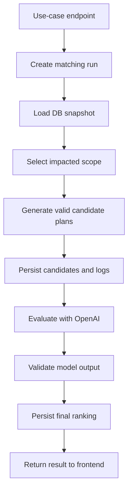

# Backend Matching Feature Plan

## Purpose

The backend matching feature recommends explainable employee-to-project assignment
changes for the CTO workflow. It should support three operational moments:

1. Balancing the current portfolio when no single new object triggered the run.
2. Rebalancing after a project is created or its staffing needs change.
3. Placing or rebalancing after an employee is created or becomes available.

The feature is a two-step pipeline:

1. Deterministic strict-rule generation creates a bounded set of valid assignment
   or reassignment possibilities.
2. OpenAI evaluation ranks those possibilities for softer tradeoffs such as team
   fit, ramp-up effort, preferences, and business risk.

The OpenAI step must never invent employees, projects, skills, or assignments. It
only evaluates candidates produced by the deterministic step.

## Current State

The repository already has the right high-level boundaries:

- `backend/main.py` is the FastAPI orchestration API. It already exposes
  `POST /projects/{project_id}/matching:run` and
  `GET /projects/{project_id}/matching/latest` placeholders.
- `backend/services/matching_service.py` is the current matching service stub.
- `backend/clients/db_client.py` is the backend's DB API client. Matching should
  use this client instead of opening database connections directly.
- `backend/clients/llm_client.py` provides the OpenAI client.
- `db-rest-api/` owns shared database persistence.
- `docs/DB_API_DOCUMENTATION.md` is the canonical database API contract.

The database currently stores projects, employees, assignments, and move
requests. It does not yet store matching runs, generated plans, or frontend
visible matching logs.

## Design Principles

- Keep strict rules deterministic, testable, and fast.
- Keep LLM evaluation advisory and constrained to validated candidate plans.
- Use IDs for all logic. Names are display aliases only.
- Persist every matching run so the frontend can show current and historical
  recommendations.
- Persist user-facing logs as structured run events, not freeform application
  logs.
- Treat assignment changes as explicit operations. A matching run recommends a
  plan; it does not silently mutate `project_assignments`.
- Create move requests from accepted recommendations, then apply assignment
  changes through explicit project or employee update endpoints.
- Make configuration data-driven enough to tune rules without changing the
  pipeline shape.

## Use Cases

### Portfolio rebalance

Goal: improve the existing assignment map across active projects.

Trigger examples:

- CTO opens a portfolio staffing view and clicks "Rebalance".
- A scheduled/manual run detects multiple projects below staffing target.
- Leadership wants a low-disruption recommendation for the current state.

Scope should include only projects with a visible staffing problem and employees
connected to those projects or plausible nearby moves. It should not explore the
entire combinatorial assignment space by default.

Endpoint:

```http
POST /matching/portfolio:rebalance
```

### Project matching or rebalance

Goal: staff a new project or rebalance around one updated project.

Trigger examples:

- CTO creates a new project.
- CTO changes `required_people_amount` or `required_skills`.
- A project is under-staffed after employees moved away.

Endpoint:

```http
POST /projects/{project_id}/matching:run
```

This endpoint can keep the existing route and expand the request model with a
use-case field if needed, but a project-scoped endpoint should remain because it
maps directly to the product flow.

### Employee placement or rebalance

Goal: place a newly created or newly available employee without rebalancing the
whole company.

Trigger examples:

- A new employee profile is created.
- An employee's lifecycle status changes to available.
- CTO wants recommended first or next project options for one employee.

Endpoint:

```http
POST /employees/{employee_id}/matching:run
```

## API Shape

Use separate public endpoints for the distinct use cases, then route each one to
the same shared pipeline.

Example request:

```json
{
  "max_recommendations": 5,
  "max_candidate_plans": 25,
  "dry_run": true,
  "rule_config": {
    "max_moves": 3,
    "allow_understaff_current_project": false,
    "minimum_skill_level_gap": 0,
    "include_preferences": true
  }
}
```

Example response:

```json
{
  "run_id": 42,
  "use_case": "project_rebalance",
  "status": "completed",
  "target_project_id": 7,
  "target_employee_id": null,
  "recommendations": [
    {
      "rank": 1,
      "candidate_plan_id": "plan_01",
      "fit_score": 0.91,
      "summary": "Best balance of backend coverage and low current-project disruption.",
      "moves": [
        {
          "employee_id": 3,
          "from_project_id": 2,
          "to_project_id": 7,
          "suggested_role": "Backend/platform engineer",
          "current_project_impact": "low",
          "reason": "Backend 3 and infrastructure 2 match the target gap."
        }
      ],
      "risks": [
        "Project 2 loses one backend-capable engineer but remains above strict minimums."
      ],
      "ramp_up_estimate": "3-5 days"
    }
  ],
  "logs": [
    {
      "level": "info",
      "stage": "strict_rules",
      "message": "Generated 18 valid candidate plans."
    }
  ]
}
```

Read endpoints:

```http
GET /matching-runs/{run_id}
GET /matching-runs/latest?use_case=project_rebalance&project_id=7
GET /projects/{project_id}/matching/latest
GET /employees/{employee_id}/matching/latest
```

Action endpoints:

```http
POST /matching-runs/{run_id}/recommendations/{candidate_plan_id}/move-requests
POST /matching-runs/{run_id}/recommendations/{candidate_plan_id}:apply
```

The first action creates `move_requests` only. The second action should be kept
admin-only or postponed until the product is ready for direct assignment
mutation.

## Shared Pipeline Location

Keep FastAPI route handlers thin and put reusable matching logic in services.

Proposed layout:

```text
backend/
  services/
    matching_service.py              # public orchestration service used by routes
    matching/
      __init__.py
      pipeline.py                    # run_matching_pipeline entry point
      models.py                      # internal typed pipeline DTOs
      strict_rules.py                # step 1 candidate generation
      llm_evaluator.py               # step 2 OpenAI ranking
      config.py                      # defaults and config validation
      logging.py                     # frontend-visible run events
```

The common entry point should receive the use case and target identifiers:

```python
run_matching_pipeline(
    use_case: MatchingUseCase,
    target_project_id: int | None,
    target_employee_id: int | None,
    request: MatchRequest,
) -> MatchingResult
```

All use-case endpoints should call this function after validating their own
path parameters.

## Pipeline Overview



Step 1 and step 2 have separate detailed plans:

- `backend/docs/MATCHING_STRICT_RULES_PLAN.md`
- `backend/docs/MATCHING_LLM_EVALUATION_PLAN.md`

## Data Snapshot

Each run should use an immutable snapshot of the data it evaluated. This keeps
results explainable even if projects or employees change afterward.

Snapshot content:

- Target project and/or employee.
- Projects in scope with required skills, required headcount, phase, repository
  links, and current team member IDs.
- Employees in scope with role, skills, preferences, interests, and current
  project IDs.
- Open move requests that could conflict with proposed moves.
- Rule configuration and version.
- LLM prompt version and model name, if step 2 runs.

Do not store secrets, API keys, raw OpenAI credentials, or hidden environment
values in snapshots or logs.

## Persistence Plan

Persistence belongs in `db-rest-api`, with documentation in
`docs/DB_API_DOCUMENTATION.md` when implemented. The backend should access these
records through `DbApiClient`.

Proposed tables:

```sql
matching_runs(
  id,
  use_case,
  target_project_id,
  target_employee_id,
  status,
  requested_by,
  rule_config,
  input_snapshot,
  candidate_count,
  recommendation_count,
  selected_candidate_plan_id,
  summary,
  error_message,
  created_at,
  started_at,
  completed_at
)
```

```sql
matching_candidates(
  id,
  run_id,
  candidate_plan_id,
  strict_score,
  hard_rule_summary,
  plan_payload,
  rejected_reason,
  created_at
)
```

```sql
matching_recommendations(
  id,
  run_id,
  candidate_plan_id,
  rank,
  fit_score,
  summary,
  explanation,
  risks,
  ramp_up_estimate,
  suggested_moves,
  model_metadata,
  created_at
)
```

```sql
matching_run_events(
  id,
  run_id,
  level,
  stage,
  event_type,
  message,
  metadata,
  created_at
)
```

Keep event rows append-only. If a run is deleted, cascade its candidates,
recommendations, and events.

## Frontend-Visible Logging

The product needs logs that can be displayed as a progress timeline or audit
view. These are not Python process logs. They are structured matching run
events stored in the database.

Event examples:

- `run.created`
- `snapshot.loaded`
- `scope.selected`
- `strict_rules.started`
- `strict_rules.completed`
- `llm_evaluation.started`
- `llm_evaluation.completed`
- `result.persisted`
- `run.failed`

Each event should include:

- `run_id`
- `level`: `debug`, `info`, `warning`, or `error`
- `stage`: `request`, `snapshot`, `strict_rules`, `llm_evaluation`,
  `persistence`, or `action`
- `message`: short safe display text
- `metadata`: compact JSON with counts and public IDs

Do not store prompt text in regular events. Store prompt and model metadata only
in the run or recommendation record if needed for audit/debugging.

## Configuration

Start with defaults in code, then allow request-level overrides for safe values.
Later, move durable organization defaults into a database table.

Recommended config groups:

- Candidate scope: maximum employees, maximum projects, include adjacent
  projects, include employees already assigned to target.
- Hard rules: minimum skill coverage, max moves, minimum remaining coverage for
  source projects, whether to move unavailable employees.
- Search bounds: maximum candidate plans, beam width, timeout budget.
- Scoring weights for deterministic pre-ranking.
- LLM settings: model name, temperature, prompt version, max candidates sent to
  the model.

Configuration should be saved with every run so old results remain explainable.

## Assignment And Move Request Semantics

Matching should recommend moves. It should not immediately alter
`project_assignments`.

Recommended flow:

1. Matching run produces ranked candidate plans.
2. CTO reviews a plan.
3. Backend creates one `move_requests` row per proposed employee move.
4. Employee accepts or rejects.
5. A separate assignment-application flow updates project or employee
   assignments by ID.

This matches the current DB contract where updating a move request status does
not automatically move employees between projects.

## Failure Handling

If step 1 produces no candidates:

- Save the run as `completed`.
- Save zero recommendations.
- Return a human-readable summary explaining which strict rules blocked all
  options.

If OpenAI fails:

- Save a warning event.
- Return deterministic candidates ordered by strict score when acceptable.
- Mark the run with `llm_status: failed` or equivalent metadata.

If model output is invalid:

- Reject invalid rows.
- Never use unknown employee or project IDs.
- If no valid recommendation remains, fall back to deterministic ordering.

If persistence fails:

- Return an error and avoid presenting an untracked recommendation as final.

## Security And Privacy

- Never log `.env` values, database credentials, OpenAI API keys, or raw
  authorization headers.
- Avoid employee performance language. Frame risk as project coverage,
  availability, skill fit, and ramp-up effort.
- Keep LLM prompts limited to business-relevant fields already visible in the
  staffing workflow.
- Store only explainable public metadata in frontend-visible events.

## Testing Strategy

Unit tests:

- Strict scope selection for each use case.
- Hard-rule filtering.
- Candidate generation limits.
- Deterministic fallback ranking.
- LLM output validation with malformed JSON, unknown IDs, and missing fields.

Service tests:

- Each endpoint creates a run and events in the expected order.
- Project-scoped run only touches reasonable nearby employees/projects.
- Employee-scoped run does not trigger a full portfolio search.
- Move-request creation uses ID fields and preserves assignment state.

DB API tests:

- Matching run CRUD/list endpoints.
- JSON serialization/deserialization.
- Cascade behavior from runs to candidates/recommendations/events.

## Rollout

1. Add persistence tables and DB API endpoints.
2. Extend backend schemas and `DbApiClient`.
3. Implement strict-rule generation with deterministic recommendations only.
4. Add frontend display for run result and run events.
5. Add OpenAI ranking behind a feature flag.
6. Add move-request creation from selected recommendations.
7. Add optional direct assignment-application flow later.

## Open Questions For Implementation

- Whether employee lifecycle status should be added before matching ships.
- Whether matching runs should be synchronous for the demo or backgrounded for
  longer searches.
- Whether accepted move requests should trigger automatic assignment mutation in
  a future workflow.
- Whether organization-level rule defaults should live in code, a config file,
  or a DB table.
